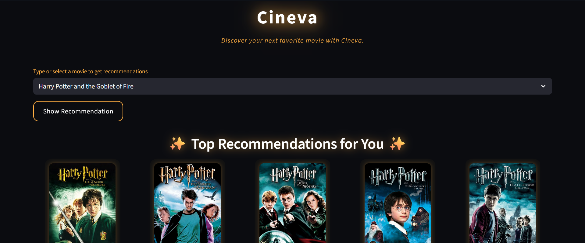
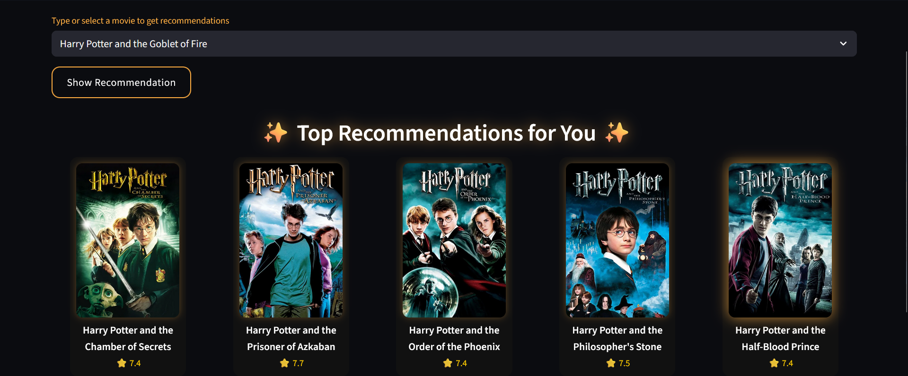
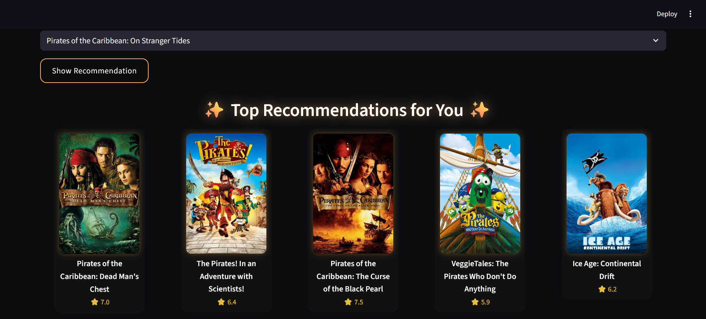

# Cineva 

*Discover your next favorite movie with Cineva.*

Cineva is a **movie recommendation system** built with **Python and Streamlit**. Users can select a movie and get **top 5 similar movie recommendations** along with posters and ratings.

---

## Features

- Search or select any movie from the dataset
- Top 5 personalized movie recommendations
- Dynamic movie posters fetched from **TMDb API**
- Ratings displayed for each recommendation
- Clean, modern UI with custom styling
- Optimized with **Streamlit caching** for faster performance

---

# Demo






## Tech Stack

- **Python** – Data processing, logic, and recommendation
- **Scikit-learn** - similarity scores calculation & vectorization
- **NLP** - text Processing(Stemming)
- **Pandas** – Handling movie datasets
- **Pickle & Gzip** – Precomputed similarity storage
- **Streamlit** – Interactive web interface
- **TMDb API** – Movie posters

---

## Installation

```bash
# Clone repo
git clone https://github.com/yourusername/Cineva.git
cd Cineva

# Create virtual environment
python -m venv venv

# Activate environment
# Windows CMD:
venv\Scripts\activate
# PowerShell:
venv\Scripts\Activate.ps1

# Install dependencies
pip install -r requirements.txt

# Run the app
streamlit run app.py
```
## Projects Structure
bash
```
Cineva/
├── app.py                  # Streamlit application
├── artifacts/
│   ├── movie_list.pkl
│   └── similarity.pkl.gz   # Compressed similarity matrix
├── demo/
│   ├── demo1.png
│   └── demo2.png
|   └── demo3.png                   # Original CSV files
├── requirements.txt
├── Movie_recommendation_system # Main Notebook
├── README.md
├── LICENSE
└── .gitignore
```
## How It Works

1. User selects a movie from the dropdown.
2. The app finds the movie's index in the dataset.
3. The precomputed similarity matrix is loaded from `similarity.pkl.gz`.
4. Top 5 similar movies are determined based on similarity scores.
5. Movie posters are fetched dynamically using the **TMDb API**.
6. Recommendations are displayed in a **grid layout** with poster, title, and rating.
